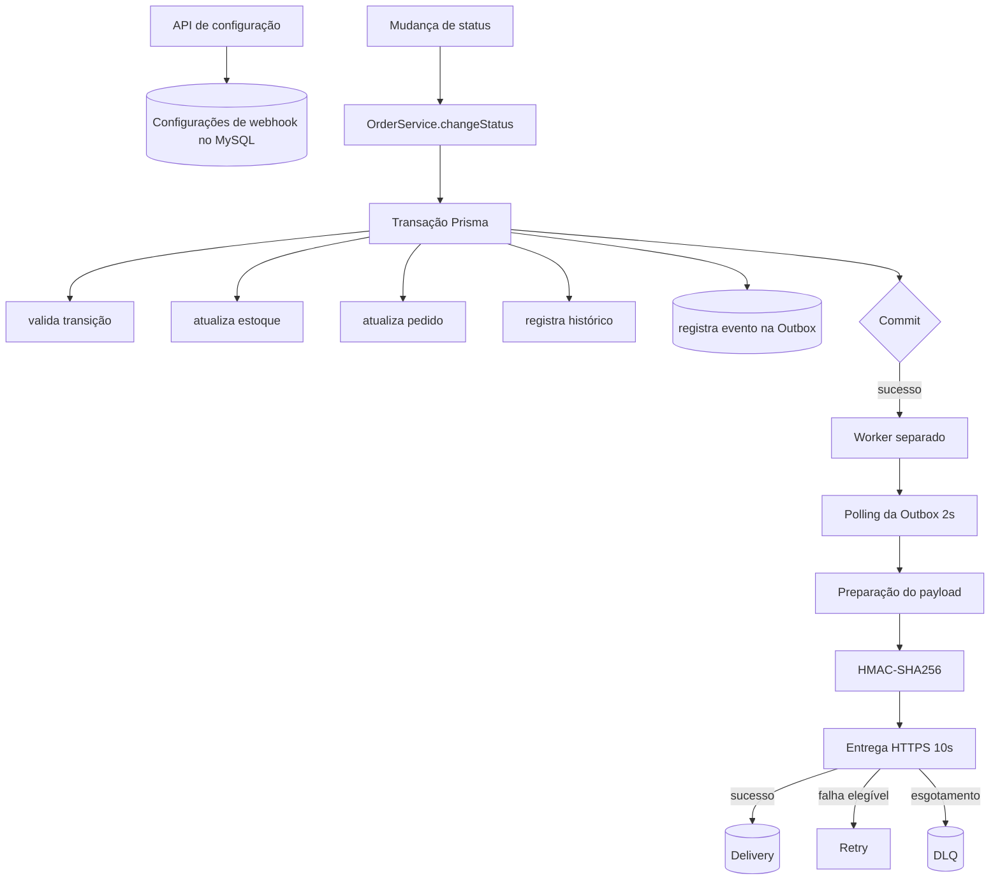

# FDD — Webhooks de Notificação de Mudança de Status de Pedidos

## Metadados

| Campo | Valor |
| ----- | ----- |
| Documento | FDD — Webhooks de Notificação de Mudança de Status de Pedidos |
| Status | Em revisão |
| Sistema | Order Management System |
| RFC relacionado | [RFC — Webhooks](./RFC.md) |
| ADRs relacionados | ADR-001 a ADR-006 |
| Responsável | Responsável pela entrega |
| Data | Não informada |

Autor, aprovador, equipe e data de calendário não constam das fontes e não são inventados. `TRANSCRICAO.md` registra apenas "quinta-feira, 09:00", sem data verificável.

## Resumo executivo

Esta feature adiciona ao Order Management System o envio de **webhooks outbound** a cada mudança de status de pedido que interesse a algum endpoint cadastrado por um cliente. Substitui o polling que os clientes B2B fazem hoje contra `GET /orders` por um modelo em que a plataforma envia e o cliente recebe, sem caminho inbound.

O desenho separa **produzir o evento** de **entregar o evento**. A produção é síncrona e transacional: o evento é gravado em uma **Outbox no MySQL existente**, dentro da mesma transação de `OrderService.changeStatus`, de modo que status confirmado e evento gravado sejam o mesmo fato — se a transação sofre rollback, nenhum dos dois existe ([ADR-001](./adrs/ADR-001-outbox-no-mysql.md)). A entrega é assíncrona e cabe a um **worker em processo separado da API**, que consulta a Outbox em **polling de 2 segundos** ([ADR-002](./adrs/ADR-002-worker-separado-com-polling.md)).

Cada entrega é assinada com **HMAC-SHA256** sobre o corpo enviado, com **secret própria por endpoint** e **rotação com grace period de 24 horas** ([ADR-004](./adrs/ADR-004-hmac-sha256-e-gestao-de-secrets.md)). A semântica é **at-least-once**: pode haver entregas duplicadas, e cada evento carrega identidade estável no header `X-Event-Id` para o consumidor deduplicar ([ADR-005](./adrs/ADR-005-entrega-at-least-once-com-event-id.md)). Falhas elegíveis são retentadas em **1m, 5m, 30m, 2h, 12h**; o que esgota o limite vai para uma **DLQ em tabela dedicada**, com **replay administrativo restrito a `ADMIN`** e auditado ([ADR-003](./adrs/ADR-003-retry-backoff-e-dlq.md)).

A implementação **reutiliza os padrões atuais do projeto** — estrutura modular, `AppError` e middleware de erro central, schemas Zod, logger Pino, `authenticate`/`requireRole`, PK em UUID — sem criar uma segunda arquitetura ([ADR-006](./adrs/ADR-006-reuso-dos-padroes-do-projeto.md)). Nenhuma infraestrutura de mensageria é introduzida. Este FDD traduz o RFC e os ADRs em componentes, contratos e fluxos; as lacunas herdadas permanecem explícitas e não são resolvidas sem evidência.

## Status

`Em revisão`

Este FDD detalha decisões já registradas em ADR-001 a ADR-006, todos com status `Aceito`. Não redefine nenhuma delas, não cria decisão arquitetural nova e não fecha as questões em aberto herdadas. O status permanece `Em revisão` até a auditoria final do próprio documento e a revisão de segurança reservada para HMAC e geração de secret.

## Documentos relacionados

| Documento | Papel |
| --------- | ----- |
| [RFC — Webhooks](./RFC.md) | Proposta técnica integrada e visão ponta a ponta. |
| [ADR-001 — Outbox no MySQL](./adrs/ADR-001-outbox-no-mysql.md) | Produção atômica do evento na transação de status. |
| [ADR-002 — Worker separado com polling](./adrs/ADR-002-worker-separado-com-polling.md) | Processamento assíncrono; polling de 2s; single-worker. |
| [ADR-003 — Retry, backoff e DLQ](./adrs/ADR-003-retry-backoff-e-dlq.md) | Retentativa, dead-letter, replay administrativo e timeout. |
| [ADR-004 — HMAC-SHA256 e gestão de secrets](./adrs/ADR-004-hmac-sha256-e-gestao-de-secrets.md) | Autenticidade, integridade, secret por endpoint e rotação. |
| [ADR-005 — At-least-once e Event ID](./adrs/ADR-005-entrega-at-least-once-com-event-id.md) | Semântica de entrega e identidade estável do evento. |
| [ADR-006 — Reuso dos padrões](./adrs/ADR-006-reuso-dos-padroes-do-projeto.md) | Incorporação à arquitetura existente. |

## Contexto e motivação técnica

Hoje os clientes B2B do Order Management System descobrem mudanças de status de pedido por **polling**: consultam `GET /orders` repetidamente contra a API. O modelo tem custo dos dois lados — a plataforma serve consultas majoritariamente vazias, e o cliente só percebe a mudança no ciclo seguinte, com latência proporcional ao intervalo de polling. Não existe caminho para a plataforma **notificar** o cliente quando o fato ocorre.

A mudança de status já é um ponto transacional bem definido: `OrderService.changeStatus`, em `src/modules/orders/order.service.ts`, executa dentro de `prisma.$transaction` a validação da transição (`canTransition`), o ajuste de estoque, o `tx.order.update` e o `tx.orderStatusHistory.create`. É o local natural para **produzir** um evento de notificação — desde que produzir o evento e confirmar o status sejam o mesmo fato atômico.

A motivação técnica central é **não acoplar a entrega externa ao caminho da requisição**. Chamar um endpoint de terceiro de dentro da transação de status significaria segurar a transação (e o estoque) pela latência e disponibilidade de um sistema externo, e arriscar que uma falha de rede desfizesse uma mudança de status legítima. A separação entre **produzir o evento** (síncrono, transacional, na Outbox do MySQL) e **entregá-lo** (assíncrono, em um worker separado, com retry e DLQ) resolve essa tensão sem introduzir mensageria dedicada, reaproveitando o banco e os padrões que o projeto já opera ([ADR-001](./adrs/ADR-001-outbox-no-mysql.md), [ADR-002](./adrs/ADR-002-worker-separado-com-polling.md), [ADR-006](./adrs/ADR-006-reuso-dos-padroes-do-projeto.md)).

## Objetivos técnicos

Objetivos que esta feature persegue, todos derivados de decisões já registradas (ADR-001 a ADR-006), não de escolhas novas deste FDD:

- **Produção atômica do evento.** O evento `order.status_changed` é gravado na Outbox dentro da **mesma transação** de `changeStatus`; o commit produz status e evento juntos, o rollback não produz nenhum ([ADR-001](./adrs/ADR-001-outbox-no-mysql.md)).
- **Desacoplar entrega do caminho da requisição.** Nenhuma chamada HTTP externa ocorre dentro da transação; a API responde após o commit, sem aguardar a entrega.
- **Entrega assíncrona resiliente.** Um worker separado consome a Outbox por polling (2s), entrega por HTTPS com timeout de 10s, retenta em 1m/5m/30m/2h/12h e encaminha à DLQ o que esgota o limite ([ADR-002](./adrs/ADR-002-worker-separado-com-polling.md), [ADR-003](./adrs/ADR-003-retry-backoff-e-dlq.md)).
- **Autenticidade e integridade da entrega.** Cada envio é assinado em HMAC-SHA256, com secret por endpoint e rotação com grace de 24h ([ADR-004](./adrs/ADR-004-hmac-sha256-e-gestao-de-secrets.md)).
- **Semântica at-least-once com deduplicação pelo cliente.** Identidade estável do evento no header `X-Event-Id`; exactly-once descartado ([ADR-005](./adrs/ADR-005-entrega-at-least-once-com-event-id.md)).
- **Operação e auditoria.** Histórico das últimas 100 entregas por webhook e replay de DLQ restrito a `ADMIN` e auditado ([ADR-003](./adrs/ADR-003-retry-backoff-e-dlq.md)).
- **Reuso da arquitetura existente.** Estrutura modular, `AppError` + middleware de erro, schemas Zod, logger Pino, `authenticate`/`requireRole`, PK em UUID — sem criar uma segunda arquitetura ([ADR-006](./adrs/ADR-006-reuso-dos-padroes-do-projeto.md)).

**Não é objetivo** desta feature: garantir entrega absoluta, ordenação global entre pedidos, exactly-once ou introduzir infraestrutura de mensageria. Esses limites são tratados em *Semântica de entrega*, *Ordenação* e *Escopo*.

## Escopo

Fazem parte desta feature:

- CRUD de configurações de webhook, autenticado.
- Filtro por status desejados, por endpoint.
- Geração da secret pela plataforma e rotação via API.
- Emissão do evento `order.status_changed` a cada transição válida que interesse a algum endpoint.
- Snapshot do payload no momento da inserção na Outbox.
- Criação do evento na mesma transação da mudança de status.
- Worker em processo separado, com polling de 2 segundos.
- Entrega HTTPS com timeout de 10 segundos e limite de payload de 64 KB.
- Assinatura HMAC-SHA256 e headers `X-Signature`, `X-Event-Id`, `X-Timestamp`, `X-Webhook-Id`, `Content-Type`.
- Histórico das últimas 100 entregas por webhook, com sucesso/falha, payload, resposta e tempo de resposta.
- Retry com a progressão decidida, DLQ e replay administrativo restrito a `ADMIN`, auditado.

### Fora de escopo

**Adiado** — deixado para fase futura, sem invalidação técnica:

- Alertas por e-mail ao cliente quando o webhook falha repetidamente.
- Rate limiting de saída ("observar e implementar se virar problema").
- Múltiplos workers em paralelo.
- Arquivamento automático das linhas entregues da Outbox (~30 dias, citado e adiado).
- Endurecimento da autorização do CRUD de configuração por role.
- Eventos além de `order.status_changed`: a taxonomia de `event_type` permanece evolução futura.

**Alternativa descartada** — avaliada e rejeitada, com registro no ADR correspondente:

- Ordenação global e exactly-once ([ADR-005](./adrs/ADR-005-entrega-at-least-once-com-event-id.md)).
- Disparo síncrono na mudança de status ([ADR-001](./adrs/ADR-001-outbox-no-mysql.md)).
- Redis, Kafka ou outra mensageria dedicada ([ADR-001](./adrs/ADR-001-outbox-no-mysql.md), [ADR-002](./adrs/ADR-002-worker-separado-com-polling.md)).
- Dashboard/painel visual para o cliente (projeto de outra equipe).

**Não pertence a esta feature**, por natureza:

- Implementação do consumidor e sua garantia de idempotência — é responsabilidade do cliente.
- Refatoração geral da aplicação.

## Premissas e restrições

- O **MySQL** continua sendo o banco; nenhuma infraestrutura de mensageria é adicionada.
- O **Prisma** continua sendo o mecanismo de persistência.
- A mudança de status permanece **transacional** em `OrderService.changeStatus`.
- A API **não aguarda** a entrega externa: responde após o commit.
- A primeira versão tem **um único worker**.
- O **consumidor é responsável pela deduplicação** via `X-Event-Id`.
- **HTTPS é obrigatório**; `http` é recusada em validação.
- A arquitetura atual **deve ser reutilizada**; o worker é a exceção justificada de lifecycle.
- A máquina de transições permanece em `src/modules/orders/order.status.ts` e **não é duplicada**.

Nenhum requisito de infraestrutura nova é presumido. Não se assume que valores como polling, timeout ou grace period serão variáveis de ambiente — a forma de configuração permanece em aberto.

## Estado atual do sistema

Comportamentos **confirmados no código** (presente do indicativo descreve o que existe hoje):

- Aplicação Node.js com TypeScript, módulos ESM, `engines.node >= 20`.
- Express 4 em `src/app.ts`, com `express.json({ limit: '1mb' })`, rota `/health` e prefixo global `/api/v1`.
- Prisma 5.22 sobre **MySQL** (`prisma/schema.prisma`, `datasource db { provider = "mysql" }`).
- Autenticação JWT bearer em `authenticate`, que popula `req.user` com `id`, `email` e `role`.
- Dois papéis: `ADMIN` e `OPERATOR` (enum `UserRole`; `AuthUser['role']`).
- Autorização por papel via `requireRole(...)`, hoje aplicada em uma única rota real: `GET /users/:id`.
- Validação com Zod pelo middleware `validate`, que converte `ZodError` em `ValidationError`.
- Logger Pino em `src/shared/logger/index.ts`, com `redact` de `req.headers.authorization`, `req.headers.cookie`, `*.password`, `*.passwordHash`, `*.token`, `*.accessToken`.
- `AppError` com `statusCode`, `errorCode` e `details`, e subclasses com códigos em maiúsculas.
- Middleware de erro central, que trata `AppError`, `ZodError` e Prisma `P2002`/`P2025`, respondendo `{ error: { code, message, details? } }`.
- Composição manual de dependências em `buildControllers`, sem container de injeção.
- Mudança de status transacional: `OrderService.changeStatus` executa, dentro de `prisma.$transaction`, a leitura do pedido, a validação da transição, o ajuste de estoque, `tx.order.update` e `tx.orderStatusHistory.create`.
- Histórico de status persistido em `OrderStatusHistory`; regras de estoque em `shouldDebitStock`/`shouldReplenishStock`.
- Testes com Vitest e Supertest; `tests/setup.ts` limpa tabelas em `beforeEach`.
- PK em UUID `@db.Char(36)` em todos os models de domínio (`User`, `Customer`, `Product`, `Order`, `OrderItem`, `OrderStatusHistory`); a exceção é `OrderNumberSequence`, tabela de sequência com PK `Int @id @default(1)`. Migrations Prisma já inicializadas.

**Não existem hoje**, e serão criados por esta feature:

- Módulo de webhooks (`src/modules/webhooks`).
- Tabelas e models de outbox, deliveries e dead-letter.
- Worker e o entry-point `src/worker.ts`; script `worker` em `package.json`.
- Secrets de webhook, sua geração e rotação; qualquer código de HMAC.
- Headers `X-Event-Id`, `X-Signature`, `X-Timestamp`, `X-Webhook-Id`.
- Replay administrativo; classes de erro com prefixo `WEBHOOK_`.

## Arquitetura futura

Visão ponta a ponta. A produção do evento é síncrona e transacional; a entrega é assíncrona e sujeita a falha. A Outbox é o ponto de articulação.



A propriedade central: o commit produz simultaneamente o status novo e o evento; o rollback não produz nenhum. Tudo o que ocorre após o commit — descoberta, assinatura, envio, retentativa — acontece fora do caminho da requisição e não pode desfazer nem bloquear a mudança de status já confirmada.

Não são definidos aqui, por não terem decisão nas fontes: estratégia de locking, tamanho de batch, concorrência interna, ferramenta de deploy e cliente HTTP.

## Organização futura dos arquivos

Estrutura conceitual proposta. Nenhum destes arquivos existe hoje.

```text
src/
├── modules/
│   └── webhooks/
│       ├── webhook.routes.ts
│       ├── webhook.controller.ts
│       ├── webhook.service.ts
│       ├── webhook.repository.ts
│       ├── webhook.schemas.ts
│       ├── webhook.types.ts
│       ├── webhook.errors.ts
│       ├── webhook.publisher.ts
│       ├── webhook.delivery.ts
│       └── webhook.signature.ts
└── worker.ts
```

| Arquivo | Classificação |
| ------- | ------------- |
| `webhook.routes.ts` | Decidido pelo padrão arquitetural ([ADR-006](./adrs/ADR-006-reuso-dos-padroes-do-projeto.md), CAN-DEC-027). |
| `webhook.controller.ts` | Decidido pelo padrão arquitetural. |
| `webhook.service.ts` | Decidido pelo padrão arquitetural. |
| `webhook.repository.ts` | Decidido pelo padrão arquitetural. |
| `webhook.schemas.ts` | Decidido pelo padrão arquitetural. |
| `webhook.types.ts` | Proposto pelo FDD; nome sujeito a revisão. |
| `webhook.errors.ts` | Proposto pelo FDD; nome sujeito a revisão. |
| `webhook.publisher.ts` | Proposto pelo FDD para abrigar `publishWebhookEvent`; nome/localização sujeitos a revisão. |
| `webhook.delivery.ts` | Proposto pelo FDD; o nome do processador do worker permanece em aberto entre `webhook.worker.ts` e `webhook.processor.ts` (CAN-OPEN-002). |
| `webhook.signature.ts` | Proposto pelo FDD para o utilitário de HMAC; nome sujeito a revisão. |
| `src/worker.ts` | Decidido: entry-point separado, com script `npm run worker` ([ADR-002](./adrs/ADR-002-worker-separado-com-polling.md), CAN-DEC-028). |

Routes, controller, service, repository e schemas são compatíveis com o padrão decidido e tratados como tais. Os demais são propostas de organização; sua existência, seus nomes e sua divisão (por exemplo, repositories separados para configuração, outbox, deliveries e DLQ) permanecem sujeitos a revisão no detalhamento.

## Componentes e responsabilidades

Cada componente é descrito por: responsabilidade, entradas, saídas, dependências, o que **não** deve fazer, arquivos existentes relacionados e status.

### Webhook Router

- **Responsabilidade:** declarar as rotas do módulo; aplicar `authenticate`; aplicar `requireRole('ADMIN')` no replay; aplicar `validate`; encaminhar ao controller.
- **Entradas:** requisições HTTP sob `/api/v1`.
- **Saídas:** delegação ao controller após middlewares.
- **Dependências:** `authenticate`, `requireRole`, `validate`, `webhook.controller`, `webhook.schemas`.
- **Não deve:** conter regra de negócio nem acessar Prisma.
- **Existentes relacionados:** `src/modules/orders/order.routes.ts`, `src/modules/users/user.routes.ts`.
- **Status:** futuro decidido.

### Webhook Controller

- **Responsabilidade:** adaptar HTTP; receber dados já validados; chamar o service; produzir respostas; encaminhar erros ao middleware via `next`.
- **Entradas:** `req` com body/params/query validados.
- **Saídas:** respostas JSON; `next(err)`.
- **Dependências:** `webhook.service`.
- **Não deve:** acessar Prisma diretamente; calcular HMAC; processar a Outbox; implementar retry; duplicar validação.
- **Existentes relacionados:** `src/modules/orders/order.controller.ts` (handlers `RequestHandler` com `try/catch` e `next(err)`).
- **Status:** futuro decidido.

### Webhook Service

- **Responsabilidade:** coordenar os casos de uso da feature (criar, listar, atualizar, remover, rotacionar, consultar histórico, replay) e aplicar suas regras, sem assumir transporte HTTP.
- **Entradas:** dados validados vindos do controller.
- **Saídas:** resultados de domínio.
- **Dependências:** `webhook.repository`, utilitários de secret e assinatura quando aplicável.
- **Não deve:** conhecer `req`/`res`; duplicar regras de pedidos.
- **Existentes relacionados:** `src/modules/orders/order.service.ts`.
- **Status:** futuro decidido.

### Webhook Repository

- **Responsabilidade:** encapsular a persistência quando compatível com o projeto; aceitar `Prisma.TransactionClient` nas operações transacionais; consultar inscrições por customer e status; persistir configurações, eventos e resultados.
- **Entradas:** filtros, entidades a persistir, `tx` quando transacional.
- **Saídas:** entidades e coleções.
- **Dependências:** `PrismaClient`/`TransactionClient`.
- **Não deve:** ser imposto onde o código existente não sustenta a abstração — `changeStatus` já acessa `this.prisma.$transaction` diretamente (CAN-COD-001), e a publicação transacional recebe o `tx` sem injetar um repository inteiro (CAN-DEC-021). A divisão entre repositories de configuração, outbox, deliveries e DLQ permanece em aberto.
- **Existentes relacionados:** `src/modules/orders/order.repository.ts`.
- **Status:** futuro decidido em alto nível; divisão interna proposta.

### Webhook Schemas

- **Responsabilidade:** declarar schemas Zod para body, params e query; exigir HTTPS na URL; reutilizar `OrderStatus` no filtro; validar paginação e limites.
- **Entradas/Saídas:** dados brutos → dados tipados.
- **Dependências:** Zod; enum `OrderStatus`; middleware `validate`.
- **Não deve:** validar manualmente no controller.
- **Existentes relacionados:** `src/modules/orders/order.schemas.ts`.
- **Status:** futuro decidido (conjunto de campos parcialmente em aberto).

### Publicador transacional

- **Responsabilidade:** dentro da transação atual, encontrar os webhooks interessados na transição, produzir o snapshot do payload, gerar o `event_id` e inserir o evento na Outbox. Assinatura acordada: `publishWebhookEvent(tx, order, fromStatus, toStatus)` (CAN-DEC-021).
- **Entradas:** `Prisma.TransactionClient` já aberto, pedido, `fromStatus`, `toStatus`.
- **Saídas:** efeito colateral persistido (linha(s) na Outbox); nenhum retorno de rede.
- **Dependências:** `TransactionClient`; consulta às configurações do customer.
- **Não deve:** iniciar nova transação; usar o singleton `prisma`; chamar HTTP; duplicar a máquina de estados.
- **Existentes relacionados:** `src/modules/orders/order.service.ts` (`changeStatus`), `src/modules/orders/order.status.ts`.
- **Status:** proposto/decidido como função; localização de arquivo proposta (`webhook.publisher.ts`).

### Worker

- **Responsabilidade:** processo separado da API que consulta a Outbox por polling, seleciona eventos elegíveis, entrega, registra resultados, reagenda retentativas e encaminha à DLQ o que esgota o limite.
- **Entradas:** eventos elegíveis na Outbox.
- **Saídas:** entregas, deliveries persistidas, reagendamentos, itens de DLQ.
- **Dependências:** instância própria de `PrismaClient` (mesma `DATABASE_URL`), logger, cliente HTTP, assinador.
- **Não deve:** iniciar o servidor HTTP; importar `buildApp`; compartilhar a instância `prisma` da API.
- **Existentes relacionados:** `src/server.ts` (lifecycle: `SIGINT`/`SIGTERM`, `prisma.$disconnect`), `src/config/database.ts` (`createPrismaClient`).
- **Status:** futuro decidido; supervisão em produção em aberto.

### Processador de entregas

- **Responsabilidade:** preparar o corpo final, calcular a assinatura, montar os headers, chamar o cliente HTTP, classificar o resultado, registrar a tentativa e reagendar ou mover para a DLQ.
- **Entradas:** evento elegível e configuração do endpoint.
- **Saídas:** delivery registrada; próximo estado do evento.
- **Dependências:** cliente HTTP, `webhook.signature`, repositórios.
- **Não deve:** presumir a classificação completa de falhas — apenas o timeout está decidido; a matriz permanece em aberto.
- **Existentes relacionados:** nenhum (não há código de entrega hoje).
- **Status:** futuro decidido; classificação de falhas em aberto.

### Cliente HTTP

- **Responsabilidade:** executar a chamada HTTPS com timeout de 10 segundos e devolver o resultado bruto ao processador.
- **Não deve:** ser escolhido silenciosamente. A biblioteca/cliente **não foi decidida** (CAN-LAC-013); `node:crypto`/`fetch` disponíveis são fato de plataforma, não decisão.
- **Status:** em aberto (cliente); decidido (timeout de 10s).

### Assinador HMAC

- **Responsabilidade:** calcular HMAC-SHA256 sobre os bytes efetivamente enviados, usando a secret ativa do endpoint.
- **Não deve:** reserializar o corpo após assinar; expor a secret ou a assinatura em log.
- **Existentes relacionados:** nenhum; `node:crypto` é builtin disponível (fato, não decisão).
- **Status:** proposto (`webhook.signature.ts`); formato, encoding e canonicalização em aberto.

### Persistência de entregas

- **Responsabilidade:** registrar cada tentativa (sucesso/falha, payload, resposta, tempo de resposta) para sustentar `GET /webhooks/:id/deliveries`.
- **Não deve:** inventar retenção ou tamanho máximo de resposta — ambos em aberto.
- **Status:** futuro decidido; campos e captura da resposta em aberto (CAN-LAC-005).

### Administração da DLQ

- **Responsabilidade:** expor o endpoint de replay restrito a `ADMIN`, recolocar o item no fluxo e registrar quem executou.
- **Não deve:** criar mecanismo próprio de autorização; garantir sucesso do reenvio.
- **Existentes relacionados:** `src/modules/users/user.routes.ts` (precedente de `requireRole('ADMIN')`).
- **Status:** endpoint decidido; identidade do evento no replay em aberto.

## Modelo de dados conceitual

Não são escritos models Prisma completos. As tabelas usarão **PK em UUID** `@db.Char(36)`, seguindo o padrão do projeto (CAN-DEC-022). Classificações: `DECIDIDO`, `NECESSÁRIO POR DERIVAÇÃO`, `PROPOSTO NO FDD`, `EM ABERTO`.

### Configuração de webhook

| Informação | Classificação | Justificativa ou origem |
| ---------- | ------------- | ----------------------- |
| Identificador UUID | DECIDIDO | Padrão de PK do projeto (CAN-DEC-022). |
| `customer_id` | DECIDIDO | Associa o webhook ao cliente (CAN-RF-002); não vem do JWT (CAN-DEC-019). |
| URL HTTPS | DECIDIDO | `http` recusada em validação (CAN-RNF-004). |
| Filtros de status | DECIDIDO | Subconjunto de `OrderStatus` (CAN-RF-007); forma de armazenar em aberto (CAN-LAC-002). |
| Secret atual | DECIDIDO | Secret por endpoint (CAN-RNF-002). |
| Secret anterior | NECESSÁRIO POR DERIVAÇÃO | Coexistência durante o grace period (CAN-RF-011). |
| Validade da secret anterior | NECESSÁRIO POR DERIVAÇÃO | Invalidação após 24h (CAN-MET-006); instante inicial em aberto. |
| Datas (criação/atualização) | PROPOSTO NO FDD | Coerência com o padrão dos models existentes. |
| Ativo/inativo | PROPOSTO NO FDD | Citado por Bruno como "estado ativo" (CAN-LAC-002), sem fechamento; tratado como proposta. |
| Armazenamento da secret (cifrado/claro) | EM ABERTO | Criptografia em repouso não decidida (CAN-LAC-004). |

### Outbox

Nome citado: `webhook_outbox` (intenção).

| Informação | Classificação | Justificativa ou origem |
| ---------- | ------------- | ----------------------- |
| `event_id` (UUID) | DECIDIDO | Criado quando o evento entra na Outbox (CAN-RF-015). |
| Tipo do evento | DECIDIDO | `order.status_changed` (CAN-DEC-024); taxonomia futura em aberto (CAN-LAC-011). |
| `webhook_id` ou relação equivalente | NECESSÁRIO POR DERIVAÇÃO | Destino da entrega; depende da opção A/B (ver *Distinção entre evento lógico e entrega*). |
| `order_id` | DECIDIDO | Campo do payload (CAN-DEC-024). |
| Payload snapshot | DECIDIDO | Renderizado na inserção (CAN-DEC-023, CAN-RF-018). |
| Criação (`created_at`) | NECESSÁRIO POR DERIVAÇÃO | Ordenação por mais antigos (CAN-DEC-004). |
| Tentativa atual (contador) | NECESSÁRIO POR DERIVAÇÃO | Limite de tentativas ([ADR-003](./adrs/ADR-003-retry-backoff-e-dlq.md)). |
| Próxima tentativa (`nextAttemptAt` ou equivalente) | NECESSÁRIO POR DERIVAÇÃO | Persistência do agendamento ([ADR-003](./adrs/ADR-003-retry-backoff-e-dlq.md), Notas). |
| Status interno | PROPOSTO NO FDD | Citados "pendente/processando/falhou/entregue" sem fechamento (CAN-LAC-001). |
| Claim/lock | EM ABERTO | Estratégia não definida (CAN-LAC-006). |
| Retenção/arquivamento | EM ABERTO | ~30 dias citado e adiado (CAN-FORA-003, CAN-LAC-009). |

### Histórico de entregas

Nome não fixado nas fontes.

| Informação | Classificação | Justificativa ou origem |
| ---------- | ------------- | ----------------------- |
| Referência ao evento | NECESSÁRIO POR DERIVAÇÃO | Correlação evento↔tentativa (CAN-LAC-005). |
| Referência ao webhook | DECIDIDO | Histórico por webhook (CAN-RF-008). |
| Número da tentativa | NECESSÁRIO POR DERIVAÇÃO | Distinguir tentativas ([ADR-005](./adrs/ADR-005-entrega-at-least-once-com-event-id.md)). |
| Início / fim / duração | DECIDIDO | Tempo de resposta é campo exigido (CAN-RF-008, CAN-MET-009). |
| Status HTTP | DECIDIDO | Sucesso/falha por entrega (CAN-RF-008). |
| Resultado (sucesso/falha) | DECIDIDO | (CAN-RF-008). |
| Erro / motivo | NECESSÁRIO POR DERIVAÇÃO | Diagnóstico. |
| Resposta (limitada) | EM ABERTO | Mecanismo de captura e tamanho não definidos (CAN-LAC-005). |

### Dead-Letter Queue

Nome citado: `webhook_dead_letter`.

| Informação | Classificação | Justificativa ou origem |
| ---------- | ------------- | ----------------------- |
| Referência ao evento | NECESSÁRIO POR DERIVAÇÃO | Correlação com a origem (CAN-LAC-001). |
| Payload | DECIDIDO | (CAN-DEC-009). |
| Motivo/contexto da falha | DECIDIDO | (CAN-DEC-009). |
| Momento da movimentação (timestamp) | DECIDIDO | (CAN-DEC-009). |
| Tentativas executadas | NECESSÁRIO POR DERIVAÇÃO | Diagnóstico. |
| Dados suficientes para replay | NECESSÁRIO POR DERIVAÇÃO | Replay recoloca no fluxo (CAN-RF-009). |
| Usuário do replay | DECIDIDO | Auditoria (CAN-RNF-006). |
| Data do replay | NECESSÁRIO POR DERIVAÇÃO | Auditoria. |
| Cópia vs. movimentação | EM ABERTO | Transferência atômica ou cópia não definida. |
| Retenção | EM ABERTO | (CAN-LAC-009). |
| Reset do contador no replay | EM ABERTO | Preservar ou zerar não definido. |
| ID no replay | EM ABERTO | Preservar/gerar/novo evento correlacionado (CAN-RF-009, [ADR-005](./adrs/ADR-005-entrega-at-least-once-com-event-id.md)). |

## Distinção entre evento lógico e entrega

O modelo da Outbox depende de uma escolha que **nem a transcrição nem os ADRs resolvem**. Este FDD registra as duas opções e mantém a questão aberta; não escolhe silenciosamente.

### Opção A — Um evento de outbox por endpoint

Cada inscrição interessada gera uma linha própria na Outbox, já com o destino definido.

- **Vantagens:** processamento e retry independentes por destino; seleção do worker trivial (cada linha é autossuficiente); DLQ direta por linha.
- **Desvantagens:** o mesmo fato de domínio gera N linhas; o snapshot é replicado; contagem de eventos difere da contagem de fatos.
- **Impacto na Outbox:** N linhas por transição com N inscritos.
- **Impacto em retries:** contador e `nextAttemptAt` por linha/destino; isolamento natural.
- **Impacto na DLQ:** uma entrada por destino que falha.
- **Impacto no `event_id`:** exige decidir se o `event_id` é único por linha (por destino) ou compartilhado entre as N linhas do mesmo fato — o que afeta a dedup do cliente com múltiplos endpoints.
- **Impacto no histórico:** cada linha já corresponde a um webhook; correlação simples.

### Opção B — Um evento lógico com múltiplas deliveries

A transição gera um único evento lógico; cada endpoint possui uma entrega associada.

- **Vantagens:** um `event_id` por fato de domínio; snapshot único; contagem de eventos igual à de fatos.
- **Desvantagens:** exige entidade de entrega por endpoint e coordenação evento↔entregas; retry por entrega dentro de um evento é mais elaborado.
- **Impacto na Outbox:** uma linha de evento; N entregas relacionadas.
- **Impacto em retries:** contador por entrega; o evento "conclui" quando todas as entregas terminam ou vão à DLQ.
- **Impacto na DLQ:** por entrega, mantendo a ligação ao evento lógico.
- **Impacto no `event_id`:** estável e único por fato; alinhado à intenção de `X-Event-Id` como identidade do evento lógico.
- **Impacto no histórico:** entrega é a unidade natural do histórico; correlação evento↔entrega explícita.

Como o filtro é aplicado **na inserção** (CAN-DEC-020) e o `X-Event-Id` identifica o **evento lógico** ([ADR-005](./adrs/ADR-005-entrega-at-least-once-com-event-id.md)), as duas opções são compatíveis com as decisões, mas produzem esquemas diferentes. **Questão em aberto**, a fechar no detalhamento.

## Integração com o sistema existente

Seção obrigatória do desafio: como o módulo de webhooks se acopla ao código que já existe, arquivo por arquivo. **Todos os caminhos abaixo foram verificados no código base.** O princípio é **estender e reutilizar**, nunca duplicar ([ADR-006](./adrs/ADR-006-reuso-dos-padroes-do-projeto.md)); o único processo novo é o worker, exceção de lifecycle justificada em [ADR-002](./adrs/ADR-002-worker-separado-com-polling.md).

| Arquivo real | Como o módulo de webhooks se integra | Natureza |
| ------------ | ------------------------------------ | -------- |
| `src/modules/orders/order.service.ts` | `changeStatus` ganha uma última etapa **dentro da mesma `prisma.$transaction`**: `publishWebhookEvent(tx, order, from, to)`, após `tx.orderStatusHistory.create`. Recebe o `TxClient` já aberto; falha na publicação provoca rollback conjunto de pedido, estoque, histórico e evento. | Extensão |
| `src/modules/orders/order.status.ts` | Reutiliza `canTransition` para confirmar que a transição é válida antes de publicar; **não duplica** a máquina de estados nem `shouldDebitStock`/`shouldReplenishStock`. O publicador consome transições já validadas. | Reuso |
| `src/shared/errors/http-errors.ts` e `src/shared/errors/app-error.ts` | As classes `WEBHOOK_*` seguem o precedente de `InvalidStatusTransitionError`/`InsufficientStockError`: estendem uma subclasse **que aceita `code` no construtor** (`BadRequestError` 400, `ConflictError` 409, `UnprocessableEntityError` 422) ou, quando o status necessário não tem subclasse assim, estendem `AppError` diretamente informando `statusCode`. **Restrição de código:** `ValidationError`, `NotFoundError`, `ForbiddenError` e `UnauthorizedError` fixam o `errorCode` no construtor e não expõem parâmetro de código, e `AppError.errorCode` é `readonly` — herdar delas produziria `VALIDATION_ERROR`/`NOT_FOUND`/`FORBIDDEN`, não o prefixo `WEBHOOK_` decidido em `[09:29]`. | Reuso |
| `src/middlewares/error.middleware.ts` | Nenhuma alteração: por serem `AppError`, os erros `WEBHOOK_*` já caem no ramo `err instanceof AppError` e saem no envelope `{ error: { code, message, details? } }`. | Reuso sem mudança |
| `src/middlewares/auth.middleware.ts` | O CRUD usa `authenticate`; o replay usa `authenticate` **e** `requireRole('ADMIN')`, mesmo precedente de `GET /users/:id`. Nenhuma role nova; `customer_id` **não** é inferido do JWT. | Reuso |
| `src/middlewares/validate.middleware.ts` | Os schemas Zod de webhook passam pelo mesmo `validate` (body/params/query), que já converte `ZodError` em `ValidationError`. HTTPS é exigido no schema, não no controller. | Reuso |
| `src/routes/index.ts` e `src/app.ts` | `buildApiRouter` passa a agregar o `webhookRouter` sob o prefixo global `/api/v1`; `buildControllers` instancia o controller de webhooks pela mesma composição manual, sem container de injeção. | Extensão |
| `src/shared/http/response.ts` | `GET /webhooks/:id/deliveries` reutiliza `paginated()`/`PaginatedResponse<T>`, mantendo o formato `{ data, pagination }` das listagens existentes. | Reuso |
| `src/shared/logger/index.ts` | O `redactPaths` é **ampliado** para incluir `*.secret`, `*.previousSecret` e `*.signature` (assinatura e secrets não podem vazar); o `createLogger` é reutilizado por API e worker. | Extensão |
| `src/config/database.ts` | O worker chama `createPrismaClient()` para abrir **instância própria** (mesma `DATABASE_URL`), sem compartilhar o singleton `prisma` da API. | Reuso |
| `src/server.ts` | `src/worker.ts` espelha o lifecycle de `bootstrap`/`shutdown` (`SIGINT`/`SIGTERM`, `prisma.$disconnect`), **sem** iniciar servidor HTTP nem importar `buildApp`. | Espelho |
| `src/middlewares/request-logger.middleware.ts` | A correlação `X-Request-Id`/`req.id` já existente é capturada no evento da Outbox no momento da produção e propagada nos logs do worker, ligando request → evento → entregas (ver *Observabilidade*). | Extensão |
| `prisma/schema.prisma` | Ganha os models de configuração, outbox, deliveries e dead-letter, seguindo a convenção de PK `@default(uuid()) @db.Char(36)` e o enum `OrderStatus` para o filtro; provider `mysql` inalterado. | Extensão |
| `tests/setup.ts` | O `beforeEach` passa a limpar também as novas tabelas, respeitando as relações; `tests/orders.test.ts` deve permanecer verde como rede de regressão da mudança transacional. | Extensão |

Quatro integrações são o núcleo do desafio e merecem destaque:

1. **`changeStatus` estendido** (`src/modules/orders/order.service.ts`) — detalhado em *Integração transacional com pedidos*, a seguir.
2. **Classes de erro reutilizadas** (`src/shared/errors/http-errors.ts`) — cada `WEBHOOK_*` deriva de `AppError`, direta ou via subclasse que aceite `code`, herdando status e envelope sem tocar no middleware.
3. **Autorização reutilizada** (`src/middlewares/auth.middleware.ts`) — `requireRole('ADMIN')` no replay, sem mecanismo próprio.
4. **Redaction ampliada** (`src/shared/logger/index.ts`) — pré-requisito de segurança antes de logar qualquer objeto de webhook.

## Integração transacional com pedidos

O método atual `changeStatus`, em `src/modules/orders/order.service.ts`, executa hoje dentro de `this.prisma.$transaction`: carrega o pedido (`tx.order.findUnique`, incluindo `items`), rejeita `from === to` com `ConflictError`, valida com `canTransition` (`InvalidStatusTransitionError`), ajusta estoque via `debitStock`/`replenishStock`, executa `tx.order.update`, grava `tx.orderStatusHistory.create` e retorna o pedido atualizado. **Não cria eventos.**

O desenho futuro, em pseudofluxo (não código TypeScript):

```text
OrderService.changeStatus
  └── prisma.$transaction(async tx => {
        1. carregar pedido
        2. validar transição (canTransition)
        3. atualizar estoque quando a transição exige
        4. atualizar pedido (tx.order.update)
        5. registrar histórico (tx.orderStatusHistory.create)
        6. publishWebhookEvent(tx, order, fromStatus, toStatus)  // insere na Outbox usando o mesmo tx
      })
```

Declarações firmes:

- A inserção usa a **mesma transação** e o **mesmo `Prisma.TransactionClient`** (`TxClient`) já aberto; não abre transação independente nem usa o singleton `prisma`.
- **Falha na inserção causa rollback** de toda a operação — pedido, estoque, histórico e evento. O erro não deve ser capturado nem silenciado.
- **Nenhuma chamada HTTP** ocorre dentro da transação.
- **Transição inválida não cria evento**: a validação precede a publicação.
- A **máquina de estados permanece no módulo de pedidos**; o publicador consome transições já validadas.
- O **snapshot representa o momento da mudança**.

Ponto a analisar — **consulta às configurações interessadas**:

- **Onde consultar:** as inscrições do customer para o `toStatus` precisam ser conhecidas para decidir se e o que inserir (filtro na inserção, CAN-DEC-020).
- **Dentro ou fora da transação:** consultar **dentro** da transação (com o mesmo `tx`) mantém a decisão coerente com o estado transacional e evita janela entre leitura e escrita, ao custo de leituras adicionais na transação já descrita como pesada; consultar **fora** reduz o peso da transação, mas abre janela de inconsistência entre a configuração lida e a inserção. Nenhuma fonte decide; **em aberto**.
- **Como evitar inconsistência entre configuração e evento:** opções incluem ler as inscrições com o `tx` corrente, ou capturar no snapshot os dados necessários para a entrega. A escolha depende também da opção A/B acima. Registrado sem fechar.

## Fluxos detalhados

Para cada fluxo: ator, pré-condições, passos, resultado esperado, falhas, efeitos persistidos, questões abertas.

### Criar webhook

- **Ator:** usuário autenticado.
- **Pré-condições:** JWT válido.
- **Passos:** autenticação (`authenticate`) → validação Zod (URL HTTPS, filtros, `customer_id`) → associação ao customer → geração da secret pela plataforma → persistência → resposta com os dados, incluindo a secret.
- **Resultado esperado:** configuração criada; secret devolvida na criação (CAN-RF-003).
- **Falhas:** `WEBHOOK_INVALID_URL` (não HTTPS), `WEBHOOK_INVALID_FILTER` (status inválido), erros de validação padrão.
- **Efeitos persistidos:** nova linha de configuração.
- **Questões abertas:** `customer_id` no body ou no path (CAN-OPEN-001); tamanho, encoding e geração da secret (CAN-LAC-003); exibição única; armazenamento em repouso (CAN-LAC-004).

### Listar webhooks

- **Ator:** usuário autenticado.
- **Pré-condições:** JWT válido; escopo por customer.
- **Passos:** autenticação → validação → consulta por customer → resposta.
- **Resultado esperado:** lista dos webhooks do customer.
- **Falhas:** validação padrão.
- **Efeitos persistidos:** nenhum.
- **Questões abertas:** paginação e parâmetros além do escopo básico (CAN-LAC-008); **a secret completa não deve ser retornada** sem decisão explícita de contrato de leitura.

### Atualizar webhook

- **Ator:** usuário autenticado.
- **Pré-condições:** webhook existente.
- **Passos:** autenticação → validação (HTTPS quando a URL muda) → persistência → resposta com o estado atualizado.
- **Resultado esperado:** configuração alterada.
- **Falhas:** `WEBHOOK_NOT_FOUND`, `WEBHOOK_INVALID_URL`, `WEBHOOK_INVALID_FILTER`.
- **Efeitos persistidos:** configuração atualizada.
- **Questões abertas:** conjunto de campos atualizáveis não fechado (CAN-LAC-002); **se eventos já criados usarão a configuração atual ou o snapshot da configuração no momento da criação do evento** permanece em aberto — dado que o payload é snapshot, mas a URL/secret de destino são lidas na entrega, o comportamento na alteração precisa ser definido.

### Remover webhook

- **Ator:** usuário autenticado.
- **Pré-condições:** webhook existente.
- **Passos:** autenticação → validação → remoção → confirmação.
- **Resultado esperado:** webhook removido do cadastro.
- **Falhas:** `WEBHOOK_NOT_FOUND`.
- **Efeitos persistidos:** remoção (física ou lógica — em aberto).
- **Questões abertas:** exclusão física **versus** desativação; impacto em eventos pendentes ainda não entregues; impacto na auditoria e no histórico. Nenhuma fonte decide; **não escolher sem evidência**.

### Rotacionar secret

- **Ator:** usuário autenticado (CRUD por ora com qualquer role autenticada).
- **Pré-condições:** webhook existente.
- **Passos:** autenticação → geração da nova secret → nova secret torna-se utilizável → secret anterior válida por 24 horas → após o prazo, a anterior é invalidada → registro para auditoria.
- **Resultado esperado:** rotação com grace de 24h (CAN-MET-006).
- **Falhas:** `WEBHOOK_NOT_FOUND`, `WEBHOOK_SECRET_ROTATION_FAILED`.
- **Efeitos persistidos:** secret atual, secret anterior e validade.
- **Questões abertas:** caminho da rota (em aberto); instante inicial das 24h; se a nova secret assina imediatamente; se há duas assinaturas simultâneas (nada nas fontes sustenta); comportamento se a rotação é pedida de novo dentro do grace.

### Criar evento na outbox

- **Ator:** `OrderService.changeStatus` (via `publishWebhookEvent`).
- **Pré-condições:** transição válida; existir inscrição interessada no `toStatus`.
- **Passos:** avaliar filtros → produzir snapshot → gerar `event_id` (UUID) → inserir na Outbox usando o mesmo `tx`.
- **Resultado esperado:** evento persistido junto ao commit; nada inserido se nenhum webhook assina o status.
- **Falhas:** exceção na inserção → **rollback conjunto**.
- **Efeitos persistidos:** linha(s) na Outbox (uma ou N, conforme opção A/B).
- **Questões abertas:** opção A/B; local exato da consulta de inscrições; status interno inicial.

### Processar evento

- **Ator:** worker.
- **Pré-condições:** evento elegível (pendente e no momento apropriado).
- **Passos:** polling → seleção por elegibilidade → carregamento da configuração do destino → preparação do corpo final → assinatura → envio HTTPS (timeout 10s) → registro da tentativa.
- **Resultado esperado:** tentativa registrada; próximo estado definido.
- **Falhas:** timeout (decidido como falha para retry); demais resultados dependem da matriz em aberto.
- **Efeitos persistidos:** delivery; atualização do evento.
- **Questões abertas:** claim/lock; batch; concorrência; cliente HTTP.

### Preparar request outbound

- **Ator:** processador de entregas.
- **Passos:** montar o corpo final a partir do snapshot → obter a secret ativa → calcular HMAC-SHA256 → montar headers (`Content-Type`, `X-Signature`, `X-Event-Id`, `X-Timestamp`, `X-Webhook-Id`).
- **Resultado esperado:** request pronto, com assinatura sobre os bytes que serão enviados.
- **Questões abertas:** encoding/formato/prefixo de `X-Signature`; formato de `X-Timestamp`; canonicalização do corpo.

### Registrar sucesso

- **Ator:** processador de entregas.
- **Passos:** avaliar o resultado → registrar delivery de sucesso → concluir o evento (ou a entrega, na opção B).
- **Observação:** o **critério de sucesso não está fechado**. Apenas o timeout está definido como falha; o que conta como sucesso (2xx e demais casos) depende da matriz de classificação, **em aberto** (CAN-LAC-007). Não é definido aqui.

### Reagendar falha

- **Ator:** processador de entregas.
- **Passos:** registrar a tentativa e sua evidência → calcular o próximo momento elegível conforme o intervalo aplicável → **preservar o `event_id`** → atualizar o agendamento de forma **persistente** (não em memória).
- **Resultado esperado:** evento volta ao fluxo no momento apropriado.
- **Questões abertas:** cálculo exato de `nextAttemptAt`; uso de jitter (não discutido); contagem "cinco tentativas" (ver *Retry*).

### Encaminhar evento à DLQ

- **Ator:** worker.
- **Passos:** ao esgotar o limite → remover do fluxo ativo → registrar na DLQ com contexto suficiente (payload, motivo, timestamp) → manter separado da Outbox.
- **Resultado esperado:** evento fora do fluxo automático, disponível para replay.
- **Questões abertas:** transferência atômica **versus** cópia; retenção; contador.

### Executar replay administrativo

- **Ator:** usuário `ADMIN`.
- **Pré-condições:** item na DLQ.
- **Passos:** `authenticate` + `requireRole('ADMIN')` → registrar quem executou (auditoria) → recolocar o evento no fluxo ("recoloca na outbox como pendente").
- **Resultado esperado:** nova tentativa possível; **duplicidade possível**, coerente com at-least-once.
- **Falhas:** `WEBHOOK_DEAD_LETTER_NOT_FOUND` (item inexistente); `FORBIDDEN` (papel insuficiente, emitido pelo `requireRole('ADMIN')` existente — não é um código `WEBHOOK_*`). Um `WEBHOOK_REPLAY_NOT_ALLOWED` só se aplicaria a uma recusa decidida no service; necessidade **em aberto** (ver *Tratamento de erros*).
- **Questões abertas:** **comportamento do `event_id`** (preserva/novo/novo correlacionado) — em aberto; reset do contador; replay em lote; limite por período.

### Consultar histórico de entregas

- **Ator:** usuário autenticado.
- **Passos:** autenticação → validação → consulta das últimas 100 entregas do webhook → resposta com sucesso/falha, payload, resposta e tempo de resposta.
- **Resultado esperado:** histórico consultável (CAN-RF-008, CAN-MET-009).
- **Questões abertas:** paginação além de "últimos 100"; **exposição da secret/assinatura no histórico deve ser evitada**.

## Contratos HTTP da API

| Operação | Método | Caminho | Autorização | Estado da definição |
| -------- | ------ | ------- | ----------- | ------------------- |
| Criar webhook | `POST` | `/api/v1/webhooks` | Autenticado | Método decidido; caminho proposto |
| Listar webhooks | `GET` | `/api/v1/webhooks` | Autenticado | Método decidido; caminho proposto |
| Atualizar webhook | `PATCH` | `/api/v1/webhooks/:id` | Autenticado | Método decidido; caminho proposto |
| Remover webhook | `DELETE` | `/api/v1/webhooks/:id` | Autenticado | Método decidido; caminho proposto |
| Consultar deliveries | `GET` | `/api/v1/webhooks/:id/deliveries` | Autenticado | Decidido em alto nível; caminho proposto sob o prefixo |
| Rotacionar secret | — | Caminho em aberto | Autenticado | Existência decidida; caminho em aberto |
| Reprocessar DLQ (replay) | `POST` | `/api/v1/admin/webhooks/dead-letter/:id/replay` | ADMIN | Decidido |

Distinções:

- **Decidido na reunião:** a forma `POST /admin/webhooks/dead-letter/:id/replay` e a existência de `GET /webhooks/:id/deliveries`; os verbos do CRUD (`POST`/`GET`/`PATCH`/`DELETE`).
- **Proposto para consistência REST:** os caminhos completos sob `/api/v1`, derivados do prefixo global de `src/app.ts` e do padrão de agregação de `src/routes/index.ts`.
- **Em aberto:** o caminho da rotação de secret. Nenhum caminho é inventado.

Detalhamento por endpoint, quando há evidência:

- **Criar:** body com `url` (HTTPS), lista de status e `customer_id` (body ou path — em aberto); response com os dados criados incluindo a secret; erros `WEBHOOK_INVALID_URL`/`WEBHOOK_INVALID_FILTER`.
- **Listar:** escopo por customer; nunca retorna a secret completa sem decisão explícita; paginação em aberto.
- **Atualizar:** `:id` UUID; campos atualizáveis parcialmente em aberto; validação de HTTPS quando a URL muda.
- **Remover:** `:id` UUID; semântica física/lógica em aberto.
- **Deliveries:** `:id` UUID; retorno das últimas 100; paginação em aberto.
- **Rotação:** autenticado; corpo e response não definidos.
- **Replay:** `:id` UUID; `requireRole('ADMIN')`; corpo/response não definidos; auditoria obrigatória.

### Convenções de status e envelope

Os contratos abaixo reutilizam, **sem alteração**, o padrão HTTP já praticado pelo projeto (fato de código, não decisão nova desta feature):

- Sucesso segue os status já usados pelos controllers existentes: `200` em leitura/atualização, `201` em criação, `204` em remoção (`src/modules/orders/order.controller.ts`).
- Erro segue o envelope único `{ error: { code, message, details? } }` produzido por `src/middlewares/error.middleware.ts`.
- Listagens seguem o formato `{ data, pagination }` de `src/shared/http/response.ts` (`paginated`).
- Os códigos `WEBHOOK_*` derivam de `AppError` (`src/shared/errors/app-error.ts`), diretamente ou por subclasse de `src/shared/errors/http-errors.ts`, e **reutilizam os status HTTP já praticados pelo projeto** (400/403/404/409), sem inventar novos.

| Código | Status HTTP | Base a estender |
| ------ | ----------: | --------------- |
| `WEBHOOK_INVALID_URL` | 400 | `BadRequestError` (aceita `code`) |
| `WEBHOOK_INVALID_FILTER` | 400 | `BadRequestError` (aceita `code`) |
| `VALIDATION_ERROR` (Zod) | 400 | tratado no middleware, sem classe nova |
| `UNAUTHORIZED` | 401 | `UnauthorizedError` (erro existente, sem prefixo) |
| `WEBHOOK_REPLAY_NOT_ALLOWED` | 403 | `AppError` direto — ver nota abaixo |
| `WEBHOOK_NOT_FOUND` | 404 | `AppError` direto (`NotFoundError` fixa `NOT_FOUND`) |
| `WEBHOOK_DELIVERY_NOT_FOUND` | 404 | `AppError` direto |
| `WEBHOOK_DEAD_LETTER_NOT_FOUND` | 404 | `AppError` direto |
| `WEBHOOK_SECRET_ROTATION_FAILED` | 409 | `ConflictError` (aceita `code`; status a confirmar) |

**Por que nem toda subclasse serve de base.** Em `src/shared/errors/http-errors.ts`, apenas `BadRequestError`, `ConflictError` e `UnprocessableEntityError` recebem `code` no construtor — é por isso que `InvalidStatusTransitionError` (`INVALID_STATUS_TRANSITION`) e `InsufficientStockError` (`INSUFFICIENT_STOCK`) conseguem publicar códigos próprios. `ValidationError`, `NotFoundError`, `ForbiddenError` e `UnauthorizedError` fixam o código internamente e não aceitam parâmetro; como `AppError.errorCode` é `readonly`, a subclasse não tem como sobrescrevê-lo. Para 403 e 404, portanto, o caminho que preserva o prefixo `WEBHOOK_` sem alterar código existente é estender `AppError` informando o `statusCode`. A alternativa — acrescentar um parâmetro `code` opcional a essas quatro classes — é viável e retrocompatível, mas constitui **alteração no código existente** e precisaria ser decidida como tal, e não como reuso.

**Nota sobre `WEBHOOK_REPLAY_NOT_ALLOWED`.** A negativa por papel no replay é produzida pelo `requireRole('ADMIN')` já existente, que emite `ForbiddenError` — ou seja, o corpo real nesse caso é `{ "error": { "code": "FORBIDDEN", "message": "Insufficient permissions" } }`. Um código `WEBHOOK_REPLAY_NOT_ALLOWED` só existiria para uma recusa de replay decidida **dentro do service** (por exemplo, item já reprocessado), não para a checagem de papel. Se nenhuma regra desse tipo for definida, o código é dispensável. **Em aberto.**

### Exemplos por endpoint

Os exemplos são **ilustrativos**: usam o envelope e os status codes reais do projeto, mas os campos ainda **em aberto** (conjunto exato de campos da configuração, `customer_id` em body vs. path, paginação, exibição da secret) estão marcados como tais e **não constituem decisão**. Valores como `whsec_PLACEHOLDER` e UUIDs abreviados são fictícios.

**1. Criar webhook — `POST /api/v1/webhooks` → `201 Created`**

Request:

```json
{
  "customer_id": "3f1a7c9e-0000-0000-0000-000000000001",
  "url": "https://cliente.example.com/webhooks/orders",
  "statuses": ["PAID", "PROCESSING", "SHIPPED"]
}
```

Response `201`:

```json
{
  "id": "9c2b4d10-0000-0000-0000-0000000000aa",
  "customer_id": "3f1a7c9e-0000-0000-0000-000000000001",
  "url": "https://cliente.example.com/webhooks/orders",
  "statuses": ["PAID", "PROCESSING", "SHIPPED"],
  "secret": "whsec_PLACEHOLDER_exibida_uma_vez",
  "active": true,
  "created_at": "2026-01-01T12:00:00.000Z"
}
```

Erro `400` (URL não HTTPS):

```json
{ "error": { "code": "WEBHOOK_INVALID_URL", "message": "Webhook URL must use HTTPS" } }
```

Campos `active`, `created_at` e a **exibição única da secret** são propostas; `customer_id` em body vs. path permanece em aberto (CAN-OPEN-001).

**2. Listar webhooks — `GET /api/v1/webhooks` → `200 OK`**

Response `200` (formato `{ data, pagination }`, secret **nunca** retornada por completo):

```json
{
  "data": [
    {
      "id": "9c2b4d10-0000-0000-0000-0000000000aa",
      "customer_id": "3f1a7c9e-0000-0000-0000-000000000001",
      "url": "https://cliente.example.com/webhooks/orders",
      "statuses": ["PAID", "PROCESSING", "SHIPPED"],
      "active": true
    }
  ],
  "pagination": { "page": 1, "pageSize": 20, "total": 1, "totalPages": 1 }
}
```

Parâmetros de paginação além do escopo básico permanecem em aberto (CAN-LAC-008).

**3. Atualizar webhook — `PATCH /api/v1/webhooks/:id` → `200 OK`**

Request:

```json
{ "statuses": ["PAID", "PROCESSING", "SHIPPED", "DELIVERED"], "active": false }
```

Response `200`: representação atualizada da configuração (mesma forma do item da listagem).
Erro `404`:

```json
{ "error": { "code": "WEBHOOK_NOT_FOUND", "message": "Webhook not found" } }
```

Conjunto de campos atualizáveis parcialmente em aberto (CAN-LAC-002); HTTPS revalidado quando a URL muda.

**4. Remover webhook — `DELETE /api/v1/webhooks/:id` → `204 No Content`**

Sem corpo na resposta (padrão de `OrderController.delete`). Semântica física vs. lógica (soft delete) permanece em aberto. Erro `404` com `WEBHOOK_NOT_FOUND`.

**5. Histórico de entregas — `GET /api/v1/webhooks/:id/deliveries` → `200 OK`**

Response `200` (últimas 100 tentativas, formato `{ data, pagination }`):

```json
{
  "data": [
    {
      "id": "d1e2f3a4-0000-0000-0000-0000000000bb",
      "event_id": "7a1b2c3d-0000-0000-0000-0000000000cc",
      "attempt": 2,
      "success": true,
      "http_status": 200,
      "response_time_ms": 143,
      "sent_at": "2026-01-01T12:00:05.000Z"
    }
  ],
  "pagination": { "page": 1, "pageSize": 100, "total": 1, "totalPages": 1 }
}
```

Captura e tamanho do corpo da resposta do cliente permanecem em aberto (CAN-LAC-005); a assinatura **não** é exposta no histórico.

**6. Replay de DLQ — `POST /api/v1/admin/webhooks/dead-letter/:id/replay` → `202 Accepted`**

Requer `authenticate` + `requireRole('ADMIN')`. Reintroduz o item no fluxo (entrega assíncrona → `202` é a proposta, coerente com "recoloca na outbox como pendente").

Response `202` (ilustrativo):

```json
{ "dead_letter_id": "e5f6a7b8-0000-0000-0000-0000000000dd", "status": "requeued" }
```

Erros:

```json
{ "error": { "code": "WEBHOOK_DEAD_LETTER_NOT_FOUND", "message": "Dead-letter entry not found" } }
```

Requisição sem papel `ADMIN` é barrada pelo `requireRole('ADMIN')` existente, que produz o erro genérico do projeto — **não** um código `WEBHOOK_*`:

```json
{ "error": { "code": "FORBIDDEN", "message": "Insufficient permissions" } }
```

Comportamento do `event_id` no replay (preserva/novo/correlacionado) permanece em aberto ([ADR-005](./adrs/ADR-005-entrega-at-least-once-com-event-id.md)); a auditoria do executor é obrigatória.

Contratos completos para questões abertas **não são inventados**; os exemplos acima são ilustrativos e marcam explicitamente o que continua em aberto.

## Contrato outbound

### Payload

Somente os campos confirmados (CAN-DEC-024):

```json
{
  "event_id": "uuid",
  "event_type": "order.status_changed",
  "timestamp": "ISO-8601",
  "order_id": "uuid",
  "order_number": "string",
  "from_status": "PAID",
  "to_status": "PROCESSING",
  "customer_id": "uuid",
  "total_cents": 10000
}
```

- O corpo é **snapshot** do momento da mudança (renderizado na inserção).
- **Não inclui `items`**, para não inflar; detalhes o cliente busca em `GET /orders/:id`.
- Limite de **64 KB**; acima disso, erro, sem truncamento.
- Nenhum campo adicional (versão, metadata, número da tentativa, id de entrega, assinatura embutida) tem sustentação nas fontes e **não é adicionado**.

### Headers

```text
Content-Type: application/json
X-Signature
X-Event-Id
X-Timestamp
X-Webhook-Id
```

- **`Content-Type: application/json`** — o corpo é JSON.
- **`X-Signature`** — assinatura HMAC-SHA256 do corpo; o cliente verifica origem e integridade.
- **`X-Event-Id`** — identidade estável do evento lógico; base da deduplicação do lado do cliente.
- **`X-Timestamp`** — timestamp do envio; permite ao cliente detectar replay "se quiser".
- **`X-Webhook-Id`** — id do cadastro de webhook; permite ao cliente com vários endpoints saber qual cadastro originou o envio.

Não são definidos: encoding, eventual prefixo `sha256=`, formato exato do timestamp, versionamento de header e múltiplas assinaturas. Permanecem em aberto (CAN-INT-010).

### Timeout

Registrado: **10 segundos** por chamada; estouro é tratado como falha e marcado para retry (CAN-MET-008, CAN-RNF-012).

Não são definidos automaticamente: connect timeout separado, read timeout separado, total timeout e comportamento após o timeout. **Detalhe a definir.**

### Limite de payload

**64 KB**; acima disso, erro, sem truncamento (CAN-MET-007). O tratamento de um payload acima do limite no contexto de retry permanece em aberto (CAN-RISK-006).

## Semântica de entrega

- **At-least-once:** o mecanismo pode produzir entregas duplicadas enquanto o evento permanecer no fluxo.
- **Evento lógico versus tentativa:** o evento é o fato de domínio, com identidade no `event_id`; a tentativa é cada execução de envio. Não são a mesma entidade.
- **Retries preservam o `event_id`:** sem isso, o header não cumpre a função decidida.
- **O consumidor deduplica** pelo `X-Event-Id`, do lado dele.
- **`event_id` não autentica:** um header é forjável; autenticidade é do HMAC ([ADR-004](./adrs/ADR-004-hmac-sha256-e-gestao-de-secrets.md)).
- **HMAC não deduplica:** assina, não identifica repetição.
- **A DLQ limita a recuperação automática:** esgotadas as tentativas, a recuperação depende de replay.
- **O replay pode repetir efeitos:** reintroduzir o evento pode gerar nova entrega duplicada.

A plataforma **não promete entrega absoluta**: indisponibilidade permanente do endpoint impede a entrega, e o retorno de um item da DLQ depende de ação operacional. **Exactly-once foi descartado.**

## Identidade de evento e tentativa

Distinção estrutural que sustenta a semântica acima:

- **Evento lógico** — o fato de domínio (o pedido mudou de `PAID` para `PROCESSING`), com identidade própria no `event_id`. O identificador é um **UUID**, **criado uma única vez** quando o evento entra na Outbox, e **persistido antes** de qualquer tentativa.
- **Tentativa de entrega** — cada execução concreta de envio a um endpoint. Um evento pode ter várias tentativas; evento e tentativa **não são a mesma entidade**, e o histórico de entregas registra tentativas, não eventos.
- **Propagação** — o mesmo identificador segue no header `X-Event-Id` em **todas** as tentativas e não muda entre retentativas.
- **Formato** — UUID, coerente com a convenção do projeto ("Tudo é uuid"). A **versão do UUID, o método e a biblioteca de geração permanecem em aberto**: `uuid` 11.0.3 no `package.json` e `crypto.randomUUID()` sob `node >= 20` são disponibilidade, não decisão.
- **Correspondência payload ↔ header** — o payload inclui um campo `event_id` (CAN-DEC-024) e o envio inclui o header `X-Event-Id`; a regra de que ambos carregam o mesmo valor **não foi definida** e deve ser fechada no detalhamento, sob risco de o cliente deduplicar por chaves distintas.
- **Identidade no replay** — se o item reprocessado conserva o `event_id` original, recebe um novo, ou constitui novo evento lógico correlacionado **permanece em aberto** ([ADR-005](./adrs/ADR-005-entrega-at-least-once-com-event-id.md)). A escolha altera o que o consumidor observa e não é decidida aqui.
- **Limites** — o `event_id` **não autentica** (header forjável; autenticidade é do HMAC), **não ordena** e **não informa a versão do payload**; não deve ser reutilizado para eventos distintos.

## Ordenação

- A v1 usa **um único worker**, processando os pendentes mais antigos.
- Há **intenção de preservar a ordem relativa dos eventos de um mesmo pedido**.
- **Não há garantia de ordenação global** entre pedidos.
- **Single worker não prova ordering:** reduz condições de concorrência, mas não é garantia formal.
- **Retries podem afetar a sequência:** um evento posterior pode ser entregue enquanto um anterior do mesmo pedido aguarda backoff.
- **Replay pode afetar a sequência.**
- **Concorrência interna, se existir, pode afetar a sequência.**

Questões em aberto (não inventar solução):

- Chave de ordenação e critério de desempate.
- Se um evento posterior deve ser bloqueado enquanto um anterior do mesmo pedido está em backoff.
- Comportamento durante o backoff.
- Processamento sequencial ou concorrente por pedido.
- Sequência durante o replay.
- Relação com múltiplos endpoints do mesmo customer.

## Estratégias de resiliência

Visão consolidada dos mecanismos que mantêm a entrega confiável apesar de falhas externas. O detalhamento de cada um está nas seções indicadas.

- **Timeout de envio:** 10s por chamada HTTPS; o estouro é tratado como falha elegível a retry, não como sucesso (ver *Contrato outbound → Timeout*). Connect/read/total timeouts separados permanecem em aberto.
- **Retry com backoff:** progressão fixa 1m → 5m → 30m → 2h → 12h, **persistida** por linha/entrega (não em memória) e preservando o `event_id` entre tentativas (ver *Retry e classificação de falhas*).
- **Fallback — DLQ + replay:** esgotadas as tentativas, o evento sai do fluxo automático e vai para a `webhook_dead_letter`, de onde só retorna por **replay administrativo** (`ADMIN`, auditado). A DLQ é o fallback: preserva a notificação em vez de descartá-la (ver *Encaminhar evento à DLQ* e *Executar replay administrativo*).
- **Isolamento do caminho de requisição:** a entrega roda no worker separado; falha, lentidão ou indisponibilidade do endpoint do cliente **não** afetam a mudança de status já confirmada.
- **Recuperação do worker:** shutdown gracioso (`SIGINT`/`SIGTERM`, `$disconnect`) espelhando `src/server.ts`; como o agendamento é persistido na Outbox, um restart retoma o trabalho pendente. Claim/lock e recuperação após crash no meio do processamento permanecem **em aberto** (ver *Concorrência, claim e transações*).
- **Contenção de amplificação:** a progressão crescente do backoff reduz o retry storm contra um endpoint degradado; jitter e rate limiting de saída permanecem em aberto.

Limites assumidos: at-least-once (pode duplicar), sem ordenação global e sem entrega garantida contra indisponibilidade permanente (ver *Semântica de entrega*).

## Retry e classificação de falhas

Progressão decidida (CAN-MET-005):

| Etapa | Intervalo |
| ----- | --------: |
| 1 | 1 minuto |
| 2 | 5 minutos |
| 3 | 30 minutos |
| 4 | 2 horas |
| 5 | 12 horas |

**Ambiguidade registrada, não resolvida:** "cinco tentativas" pode significar cinco envios totais (incluindo o primeiro) ou cinco retentativas adicionais. Há um indício aritmético (os cinco intervalos somam ~14h36min, compatível com "quase 15 horas entre primeira falha e última tentativa"), **não conclusivo e não adotado**. O detalhamento deverá esclarecer a contagem antes da implementação. **Em aberto.**

Matriz de classificação (apenas o timeout está fechado):

| Resultado | Tratamento | Situação |
| --------- | ---------- | -------- |
| HTTP 2xx | A definir | Em aberto |
| HTTP 3xx | A definir | Em aberto |
| HTTP 4xx | A definir | Em aberto |
| HTTP 5xx | A definir | Em aberto |
| Timeout | Retry mencionado, regra exata em aberto | Parcial |
| DNS | A definir | Em aberto |
| TLS | A definir | Em aberto |
| Conexão recusada | A definir | Em aberto |
| URL inválida | A definir | Em aberto |
| Endpoint removido | A definir | Em aberto |

Nenhuma política é inventada. Classificar como retentável o que é permanente consome ciclos contra endpoint inválido; classificar como permanente o que é transitório descarta eventos recuperáveis — as consequências são simétricas e reais.

## Segurança

### HTTPS

Obrigatório; `http` é recusada na validação Zod (classificada por Sofia como validação de schema). Versão mínima de TLS, cipher suites, mTLS e política de redirects **não foram discutidos** e permanecem em aberto.

### HMAC-SHA256

Fluxo conceitual:

1. montar o corpo final;
2. obter a secret ativa do endpoint;
3. calcular HMAC-SHA256 sobre os **bytes** desse corpo;
4. adicionar a assinatura em `X-Signature`;
5. enviar exatamente o corpo assinado, sem reserialização.

O HMAC prova **posse da secret** (autenticidade) e detecta adulteração (integridade). **Não fornece confidencialidade** — isso depende do HTTPS —, não identifica pessoa e, sendo simétrico, não oferece não repúdio.

### Gestão de secrets

- Secret **por endpoint**, nunca global ("se vaza uma, vaza tudo"; há precedente real de vazamento em log).
- A plataforma **precisa armazenar material capaz de assinar** — não basta um hash irreversível.
- O acesso deve seguir o menor privilégio.
- Uma secret de endpoint é credencial por cliente e **não se confunde** com o `JWT_SECRET` global.

### Rotação

Nova secret utilizável; a anterior válida por **24 horas** em paralelo; depois, invalidada. Coexistência temporária das duas secrets. Instante inicial das 24h, ativação da nova e mecanismo de expiração **em aberto**.

### Proteção de logs

O `redact` atual **não cobre** `secret` nem assinatura. Deverá ser **ampliado/revisado** antes de registrar objetos de webhook. Atenção ao campo `details` de erros que estendam `AppError`, devolvido ao cliente e potencialmente logado. Payloads e respostas de terceiros também podem conter dado sensível.

### Replay attacks

`X-Timestamp` **poderá** auxiliar o cliente a detectar replay. **O HMAC sozinho não impede replay:** uma mensagem íntegra e assinada pode ser reenviada por quem a capturou. Nenhuma política anti-replay foi decidida — tolerância de relógio, janela de validade, uso do timestamp no cálculo da assinatura e verificação obrigatória pelo consumidor **em aberto**. O timestamp **não é proteção completa**.

## Autenticação e autorização

- O **CRUD** de configuração usa `authenticate`; por ora qualquer role autenticada basta (endurecimento adiado).
- O **replay** usa `authenticate` **e** `requireRole('ADMIN')`, com precedente real em `buildUserRouter`.
- O **JWT representa o operador**, não o cliente; por isso o `customer_id` **não deve ser inferido do token**.
- Body ou path para o `customer_id` **permanece em aberto** (CAN-OPEN-001).
- **Nenhuma role nova** é criada: os papéis continuam `ADMIN` e `OPERATOR`.

## Validação

Reutiliza Zod e o middleware `validate`. Validações esperadas:

- UUID em params (`:id`).
- URL **HTTPS** (decidida).
- Status permitido (subconjunto de `OrderStatus`, decidido) e filtros.
- Payload máximo de 64 KB (decidido; ponto de aplicação a definir).
- Paginação (proposta; parâmetros em aberto).
- Campos obrigatórios do body (parcialmente em aberto, conforme o conjunto de campos da configuração).

Validações **decididas** (HTTPS, filtro por `OrderStatus`, UUID) distinguem-se das **propostas** (paginação, formato de campos ainda não fechados). A validação **não é duplicada** manualmente no controller.

## Tratamento de erros

Matriz de erros **propostos no FDD** (não existem hoje), todos com prefixo `WEBHOOK_`:

| Código | Status HTTP | Base a estender | Quando ocorre |
| ------ | ----------: | --------------- | ------------- |
| `WEBHOOK_NOT_FOUND` | 404 | `AppError` direto | Configuração inexistente em update/delete/rotação/deliveries. |
| `WEBHOOK_INVALID_URL` | 400 | `BadRequestError` | URL ausente ou não HTTPS. |
| `WEBHOOK_INVALID_FILTER` | 400 | `BadRequestError` | Status fora do subconjunto de `OrderStatus`. |
| `WEBHOOK_DELIVERY_NOT_FOUND` | 404 | `AppError` direto | Entrega inexistente na consulta de histórico. |
| `WEBHOOK_DEAD_LETTER_NOT_FOUND` | 404 | `AppError` direto | Item de DLQ inexistente no replay. |
| `WEBHOOK_REPLAY_NOT_ALLOWED` | 403 | `AppError` direto | Recusa de replay decidida no service — **não** a checagem de papel, que devolve `FORBIDDEN` via `requireRole`. Necessidade em aberto. |
| `WEBHOOK_SECRET_ROTATION_FAILED` | 409 | `ConflictError` | Falha ao rotacionar a secret (status a confirmar). |

Todos deverão **derivar de `AppError`** — diretamente, ou por uma subclasse que aceite `code` no construtor (`BadRequestError`, `ConflictError`, `UnprocessableEntityError`) —, usar o **prefixo `WEBHOOK_`** e serão tratados pelo **middleware de erro central sem alteração** (`src/middlewares/error.middleware.ts`), no envelope atual `{ error: { code, message, details? } }`. **Não** devem derivar de `ValidationError`, `NotFoundError`, `ForbiddenError` ou `UnauthorizedError`: essas classes fixam o `errorCode` e não o expõem como parâmetro, e `AppError.errorCode` é `readonly`, de modo que a herança apagaria o prefixo decidido (ver *Convenções de status e envelope*). **Nenhum novo formato de resposta** é criado. Atenção: `details` **não deve** carregar secret ou assinatura. Erros de validação Zod continuam saindo como `VALIDATION_ERROR` (400) pelo mesmo middleware.

## Observabilidade

Três planos — **logs**, **métricas** e **tracing/correlação** — reutilizando o que a aplicação já expõe. Ferramenta, backend e SLO **não são escolhidos aqui**; o que segue são necessidades e propostas, não decisões da reunião.

### Logs

Logs estruturados via Pino (`src/shared/logger/index.ts`), reutilizados na API e no worker. Campos recomendados por entrega: `event_id`, `webhook_id`, `order_id`, número da tentativa, estado, duração, status HTTP, categoria da falha, sinalização de DLQ, replay e administrador executor.

**Nunca registrar:** secret atual, secret anterior, assinatura, header `authorization`, nem dado sensível sem revisão. O `redactPaths` atual **não cobre** `secret` nem `signature` e **deverá ser ampliado** antes de logar objetos de webhook (ver *Integração com o sistema existente*). Atenção ao campo `details` de erros `AppError`, devolvido ao cliente e potencialmente logado.

### Métricas

Métricas conceituais (necessidades/propostas): profundidade da Outbox; idade do evento pendente mais antigo; entregas bem-sucedidas; falhas por categoria; retries; latência da chamada externa; profundidade da DLQ; volume de replay; backlog/lag de processamento do worker. **Nenhuma ferramenta** de métricas, dashboard, alerta ou SLO é escolhida.

### Tracing e correlação

O projeto **já possui correlação por requisição**: `src/middlewares/request-logger.middleware.ts` gera (ou reaproveita de `x-request-id`) um `requestId`, popula `req.id`, devolve o header `X-Request-Id` na resposta e emite o log `http_request` com `requestId`, `method`, `path`, `statusCode`, `durationMs` e `userId`. É sobre essa base que o tracing da feature se apoia, sem introduzir framework novo.

O desafio de tracing dos webhooks é o **salto assíncrono**: a produção do evento acontece numa requisição HTTP, mas a entrega ocorre depois, em outro processo. A proposta é propagar um **id de correlação** ao longo de toda a cadeia:

- **Produção:** capturar o `req.id` (correlação da requisição que mudou o status) no evento gravado na Outbox, ao lado do `event_id`.
- **Processamento:** o worker registra cada ciclo carregando `event_id` (identidade estável do evento lógico) e o id de correlação de origem, de modo que produção e todas as tentativas fiquem ligadas.
- **Entrega:** o envio já leva `X-Event-Id`; opcionalmente, propagar um header de correlação (por exemplo, `X-Request-Id`) ao endpoint do cliente permite rastrear ponta a ponta, **se decidido**.

Assim, o `event_id` funciona como a **chave de trace** natural do fluxo assíncrono (request → Outbox → worker → tentativas → delivery/DLQ), unindo os logs dos dois processos sem um coletor dedicado. A adoção de **tracing distribuído formal** (OpenTelemetry, spans, propagação `traceparent`) é uma **evolução possível, não decidida** — registrada como proposta, não como escolha.

## Configurações

| Valor | Valor decidido | Fonte possível | Forma de configuração |
| ----- | -------------: | -------------- | --------------------- |
| Polling | 2 segundos | [ADR-002](./adrs/ADR-002-worker-separado-com-polling.md) | Em aberto |
| Timeout HTTP | 10 segundos | Transcrição/RFC | Em aberto |
| Payload máximo | 64 KB | Transcrição/RFC | Em aberto |
| Grace period | 24 horas | [ADR-004](./adrs/ADR-004-hmac-sha256-e-gestao-de-secrets.md) | Em aberto |
| Backoff | 1m/5m/30m/2h/12h | [ADR-003](./adrs/ADR-003-retry-backoff-e-dlq.md) | Em aberto |

A "forma de configuração" pode ser constante, variável de ambiente ou banco, e permanece **em aberto** — não se decidiu transformar esses valores em env vars (CAN-INT-008). Nomes como `WEBHOOK_POLL_INTERVAL_MS` **poderão** ser apresentados apenas como proposta, nunca como decisão. Secrets por endpoint são dados persistidos por cadastro e não devem ser tratadas como variável de ambiente.

## Concorrência, claim e transações

Permanecem **em aberto** e não são decididos aqui (CAN-LAC-006, CAN-LAC-014):

- Tamanho do batch de polling ("batch pequeno" citado, sem número).
- Processamento sequencial ou concorrente dentro do worker.
- Comportamento quando um ciclo de polling anterior ainda está ativo.
- Estratégia de claim.
- Lock / lease.
- Estado intermediário do evento.
- Recuperação após crash do worker durante o processamento.
- Múltiplos eventos do mesmo pedido.
- Dois workers iniciados acidentalmente.

**Não são introduzidos como decisão:** `SELECT ... FOR UPDATE`, `SKIP LOCKED`, optimistic locking, advisory lock ou um status `PROCESSING`. Essas opções **poderão** ser avaliadas no detalhamento como alternativas técnicas, claramente marcadas como tais, e nunca presumidas a partir do single worker.

## Estratégia de testes

Seguem o padrão existente (Vitest, Supertest, `getTestApp`, `bootstrapAuthenticatedUser`). Nenhum teste executável é escrito aqui.

### Testes unitários

- Aplicação de filtros de status.
- Construção do snapshot e geração do payload (campos e ausência de `items`).
- Cálculo do HMAC (payload íntegro vs. modificado; secret incorreta).
- Grace period (dentro e após a janela).
- Cálculo do próximo momento elegível.
- Preservação do `event_id` entre tentativas.
- Classificação de falhas (após a matriz ser definida).
- Validações Zod, incluindo HTTPS.

### Testes de integração

- CRUD de configuração; autenticação; autorização (`ADMIN` no replay).
- Atomicidade: evento criado na transação de `changeStatus`.
- Rollback conjunto quando a inserção falha.
- Outbox, deliveries e DLQ.
- Rotação e replay; auditoria do replay.

### Testes do worker

- Polling; seleção de evento elegível.
- Sucesso; timeout tratado como falha; falha e retry.
- Encaminhamento à DLQ ao esgotar o limite.
- Restart e shutdown; comportamento sob backlog.

### Testes ponta a ponta

- Mudança de status → criação do evento → entrega.
- Retry; replay; duplicidade observável.

### Regressão

- Estoque, histórico e transições permanecem corretos.
- Pedido sem webhook não é afetado (nenhum evento inserido).
- Transição inválida não cria evento.

Impacto em testes existentes:

- `tests/setup.ts` deverá limpar as **novas tabelas** em `beforeEach`, respeitando as relações (a ordem atual limpa `orderStatusHistory`, `orderItem`, `order`, `orderNumberSequence`, `product`, `customer`, `user`).
- `tests/orders.test.ts` deve **permanecer verde**: é a rede de regressão da mudança transacional.
- `tests/helpers/factories.ts` **poderá** ganhar factories de webhook.

Testar o worker, por ser processo separado, **poderá** exigir estratégia adicional; a forma não está definida.

## Dependências, migração e compatibilidade

### Dependências

Runtime e bibliotecas — **todas já presentes** no projeto, exceto o cliente HTTP de saída (em aberto):

- **Node.js ≥ 20** (`engines.node`), TypeScript, módulos ESM.
- **Express 4** para o router do CRUD sob `/api/v1`.
- **Prisma 5.22 + MySQL** para outbox, deliveries, dead-letter e configuração — nenhuma mensageria nova.
- **Zod** para os schemas de validação; **Pino** para logs.
- **`uuid` 11.0.3** e/ou `crypto.randomUUID()` (`node >= 20`) para o `event_id` — disponibilidade; geração exata em aberto.
- **`node:crypto`** (builtin) para HMAC-SHA256.
- **Cliente HTTP de saída: em aberto** (CAN-LAC-013) — `fetch` nativo é disponibilidade, não decisão.
- **Novo entry-point:** `src/worker.ts` e script `npm run worker` (a criar; ainda não existe em `package.json`).

Nenhuma dependência de infraestrutura nova (broker, cache, fila) é introduzida.

### Migração

Sequência em alto nível:

1. Criar as estruturas (nova migration Prisma para configuração, outbox, deliveries e dead-letter, com PK em UUID).
2. Gerar o Prisma Client.
3. Implantar a API com o módulo de webhooks.
4. Implantar o worker como processo separado.
5. Validar (worker ativo antes de habilitar clientes).
6. Habilitar clientes por cadastro (o próprio CRUD é o rollout incremental).

### Compatibilidade

- **Nenhuma alteração no contrato atual de pedidos.**
- Webhooks são recurso **adicional**; clientes sem webhook cadastrado **não são afetados**.
- A mudança de status passa a incluir **escrita adicional** na Outbox.
- **Falha na Outbox poderá causar rollback** da mudança de status.

Em aberto: feature flag; procedimento de rollback; reversibilidade da migration; backfill de eventos anteriores à ativação; dados iniciais (CAN-LAC-012).

## Implantação e operação

- API e worker são **processos separados**.
- O worker inicia com **Prisma próprio** (mesma `DATABASE_URL`).
- O worker deve ter **shutdown gracioso** (`SIGINT`/`SIGTERM`, `$disconnect`), espelhando `src/server.ts`, **sem** iniciar servidor HTTP.
- O worker deve estar **operacional antes de ativar clientes**.
- A **revisão de segurança** (HMAC e geração de secret) deve ocorrer antes do deploy, com os dois dias úteis reservados.
- **Backlog e DLQ** devem ser acompanhados.

Em aberto: Kubernetes, Docker Compose, PM2 ou systemd; health check e readiness; supervisão; número de réplicas; política de restart; rollback (CAN-LAC-010).

## Riscos técnicos e mitigação

| Risco | Impacto | Tratamento ou estado | Documento relacionado |
| ----- | ------- | -------------------- | --------------------- |
| Crescimento da Outbox | Degradação de leitura e disco | Arquivamento ~30d adiado; retenção indefinida. Em aberto | [ADR-001](./adrs/ADR-001-outbox-no-mysql.md) |
| Worker parado sem detecção | Eventos acumulam; ninguém notificado | Sem supervisão/health check definidos. Em aberto | [ADR-002](./adrs/ADR-002-worker-separado-com-polling.md) |
| Backlog acima da capacidade | Latência acima de 10s | Single worker na v1; escala adiada; métricas de lag indefinidas. Em aberto | [ADR-002](./adrs/ADR-002-worker-separado-com-polling.md) |
| Duplicidade por retry/replay | Cliente processa evento repetido | Consequência aceita do at-least-once; dedup via `X-Event-Id` | [ADR-005](./adrs/ADR-005-entrega-at-least-once-com-event-id.md) |
| Perda de ordem por pedido | Transições observadas fora de sequência | Intenção sob single worker, sem garantia; retries afetam ordem. Em aberto | [ADR-002](./adrs/ADR-002-worker-separado-com-polling.md) |
| Retry storm contra endpoint degradado | Amplificação de carga sobre cliente já em dificuldade | Progressão crescente mitiga em parte; jitter e rate limiting indefinidos. Em aberto | [ADR-003](./adrs/ADR-003-retry-backoff-e-dlq.md) |
| Secret exposta em log | Forja de mensagens naquele endpoint | Secret por endpoint contém o raio; redaction insuficiente hoje. Em aberto | [ADR-004](./adrs/ADR-004-hmac-sha256-e-gestao-de-secrets.md) |
| Serialização divergente do corpo | Assinatura inválida em mensagens legítimas | Assinar os bytes enviados; canonicalização a definir. Em aberto | [ADR-004](./adrs/ADR-004-hmac-sha256-e-gestao-de-secrets.md) |
| Payload acima de 64 KB | Evento não enviado | Erro sem truncamento; tratamento no retry indefinido. Em aberto | [ADR-001](./adrs/ADR-001-outbox-no-mysql.md) |
| Replay indevido ou massivo | Reenvio em massa a clientes | `requireRole('ADMIN')` e auditoria; limite por período indefinido. Em aberto | [ADR-003](./adrs/ADR-003-retry-backoff-e-dlq.md) |
| Evento perdido entre Outbox e DLQ | Notificação some sem registro | Transferência atômica vs. cópia indefinida. Em aberto | [ADR-003](./adrs/ADR-003-retry-backoff-e-dlq.md) |
| Contador de tentativas inconsistente | Retentativas a mais ou a menos | Agravado pela ambiguidade da contagem. Em aberto | [ADR-003](./adrs/ADR-003-retry-backoff-e-dlq.md) |
| Dois workers acidentais | Duplo envio; ordem afetada | Single worker é decisão; claim e garantia operacional indefinidos. Em aberto | [ADR-002](./adrs/ADR-002-worker-separado-com-polling.md) |
| Endpoint removido | Entregas contra destino inexistente | Tratamento de URL desativada indefinido. Em aberto | [ADR-003](./adrs/ADR-003-retry-backoff-e-dlq.md) |
| Falha na consulta de configurações | Evento não inserido ou inconsistente | Local da consulta (dentro/fora da transação) indefinido. Em aberto | [ADR-001](./adrs/ADR-001-outbox-no-mysql.md) |
| Retenção indefinida | Crescimento de outbox, deliveries e DLQ | Política não definida. Em aberto | [ADR-003](./adrs/ADR-003-retry-backoff-e-dlq.md) |
| Resposta externa sensível persistida | Vazamento e custo de armazenamento | Tamanho máximo da resposta indefinido. Em aberto | [ADR-003](./adrs/ADR-003-retry-backoff-e-dlq.md) |

## Questões em aberto

Não respondidas sem evidência.

1. `customer_id` no body ou no path?
2. Um evento por endpoint (Opção A) ou um evento lógico com múltiplas deliveries (Opção B)?
3. "Cinco tentativas" são cinco envios totais ou cinco retries?
4. Quais respostas HTTP representam sucesso?
5. Quais falhas devem gerar retry?
6. Como será feito o claim das linhas?
7. Haverá estado intermediário do evento?
8. Como recuperar após crash do worker?
9. Qual será o tamanho do batch?
10. Haverá concorrência interna no worker?
11. Como preservar a ordenação por pedido?
12. Um evento posterior poderá ultrapassar um evento em backoff?
13. O replay preservará o `event_id`?
14. Como a secret será gerada?
15. Como a secret será armazenada em repouso?
16. A secret será exibida apenas uma vez?
17. Qual será o formato da assinatura (encoding/prefixo/canonicalização)?
18. O timestamp fará parte da assinatura?
19. Qual será a política anti-replay?
20. Quais valores serão configuráveis, e como?
21. Qual será a retenção de outbox, deliveries e DLQ?
22. Como o worker será supervisionado em produção?
23. Qual cliente HTTP será utilizado?
24. Como tratar endpoints removidos?
25. Como tratar configuração alterada após a criação do evento?
26. Como limitar a resposta externa persistida?
27. Como evitar dois workers acidentais?
28. Qual será o caminho da rota de rotação?
29. Como será a paginação de deliveries?
30. Como será auditado o replay (formato e destino)?

## Critérios de aceite técnico

Uma implementação estará conforme quando:

- O evento for criado na **mesma transação** da mudança de status.
- Houver **rollback** quando a inserção na Outbox falhar.
- **Nenhuma chamada HTTP** ocorrer dentro da transação.
- **Transição inválida não criar evento**.
- O worker for **processo separado**, com Prisma próprio.
- O **polling** ocorrer a cada **2 segundos**.
- O **timeout** de envio for de **10 segundos**.
- A **URL** exigir **HTTPS**.
- O **payload** respeitar o limite de **64 KB**.
- A assinatura usar **HMAC-SHA256**, com **secret por endpoint**.
- A **rotação** manter a secret anterior válida por **24 horas**.
- O header **`X-Event-Id`** for enviado e **preservado nas retentativas**.
- Os **intervalos** de retry forem respeitados.
- O **esgotamento** encaminhar o evento à **DLQ** em tabela separada.
- O **replay** exigir **`ADMIN`** e ser **auditado**.
- A **duplicidade** ser documentada como comportamento esperado.
- **Secrets e assinaturas não aparecerem** em logs.
- O código seguir os **padrões existentes** e **não duplicar** regras de pedidos.
- As **questões abertas não serem implementadas** sem decisão registrada.

## Evidências e rastreabilidade

| Tipo | Localização | Informação sustentada |
| ---- | ----------- | --------------------- |
| TRANSCRICAO | `[09:02]` Marcos | "Tempo real" = <10s; janela que viabiliza o polling. |
| TRANSCRICAO | `[09:06]`–`[09:08]` Diego/Larissa | Outbox no MySQL na mesma transação; síncrono descartado. |
| TRANSCRICAO | `[09:09]`–`[09:13]` Diego/Larissa | Polling de 2s; worker separado; single worker; sem ordering global. |
| TRANSCRICAO | `[09:15]`–`[09:18]` Diego/Larissa | 5 tentativas; 1m/5m/30m/2h/12h; DLQ em tabela separada; replay. |
| TRANSCRICAO | `[09:20]`–`[09:23]` Sofia | HMAC-SHA256; secret por endpoint; grace 24h; HTTPS; 64 KB. |
| TRANSCRICAO | `[09:24]`–`[09:26]` Diego/Larissa | At-least-once; `X-Event-Id`; dedup pelo cliente; exactly-once descartado. |
| TRANSCRICAO | `[09:31]`–`[09:37]` Marcos/Larissa/Sofia | CRUD por verbo; secret devolvida na criação; `customer_id` body/path; deliveries últimas 100; replay ADMIN + auditoria. |
| TRANSCRICAO | `[09:40]`–`[09:44]` Bruno/Diego/Sofia | Inserção na mesma transação com rollback; `publishWebhookEvent(tx, ...)`; timeout 10s; payload e headers. |
| TRANSCRICAO | `[09:51]`–`[09:52]` Larissa/Diego | "Tudo é uuid"; snapshot na inserção. |
| CODIGO | `src/modules/orders/order.service.ts` — `changeStatus`, `TxClient` | Transação com validação, estoque, `order.update`, `orderStatusHistory.create`; ponto de `publishWebhookEvent`. |
| CODIGO | `src/modules/orders/order.status.ts` — `canTransition`, `shouldDebitStock`, `shouldReplenishStock` | Máquina de transições e efeitos de estoque; não duplicar. |
| CODIGO | `src/app.ts` — `buildApp`, `buildControllers` | Composição manual; `express.json({ limit: '1mb' })`; `/api/v1`; `errorMiddleware`. |
| CODIGO | `src/routes/index.ts` — `buildApiRouter`, `Controllers` | Agregação por domínio; ponto de registro de `/webhooks` e da rota de replay. |
| CODIGO | `src/middlewares/auth.middleware.ts` — `authenticate`, `requireRole`, `AuthUser` | JWT bearer; papéis `ADMIN`/`OPERATOR`. |
| CODIGO | `src/middlewares/validate.middleware.ts` — `validate` | Zod em body/query/params; `ZodError` → `ValidationError`. |
| CODIGO | `src/middlewares/error.middleware.ts` — `errorMiddleware` | Envelope `{ error: { code, message, details? } }`; Prisma `P2002`/`P2025`; fallback 500. |
| CODIGO | `src/shared/errors/app-error.ts` — `AppError` | `statusCode`, `errorCode`, `details`; base de `WEBHOOK_*`. |
| CODIGO | `src/shared/logger/index.ts` — `redactPaths`, `createLogger` | Redaction sem `secret` nem assinatura; a revisar. |
| CODIGO | `src/config/env.ts` — `envSchema`, `env` | Zod sem variáveis de webhook; nenhuma env nova decidida. |
| CODIGO | `src/config/database.ts` — `createPrismaClient`, `prisma` | Fábrica/singleton; worker abre instância própria. |
| CODIGO | `src/server.ts` — `bootstrap`, `shutdown` | Lifecycle `SIGINT`/`SIGTERM`, `$disconnect`; referência para `src/worker.ts`. |
| CODIGO | `prisma/schema.prisma` | Provider `mysql`; PKs `@default(uuid()) @db.Char(36)` nos models de domínio (`OrderNumberSequence` usa PK `Int`); enum `OrderStatus`; sem models de webhook. |
| CODIGO | `package.json` — `scripts`, `dependencies` | Sem script `worker`; `uuid` 11.0.3 e `node >= 20` disponíveis (fato, não decisão). |
| CODIGO | `tests/setup.ts` | Limpeza por `beforeEach`; a estender às novas tabelas. |
| CODIGO | `tests/orders.test.ts` | Rede de regressão da mudança transacional; deve permanecer verde. |
| RFC | [RFC — Webhooks](./RFC.md) | Visão integrada; contratos em alto nível; questões abertas. |
| ADR | [ADR-001](./adrs/ADR-001-outbox-no-mysql.md) a [ADR-006](./adrs/ADR-006-reuso-dos-padroes-do-projeto.md) | Decisões arquiteturais aceitas que este FDD detalha. |
| MATRIZ | `MATRIZ-FATOS.md` §2–§3 | IDs canônicos citados e sua rastreabilidade. |
| ANALISE | `ANALISE-EVIDENCIAS.md` §15, §18, §19 | Índice auxiliar de integrações, ambiguidades e lacunas. |
